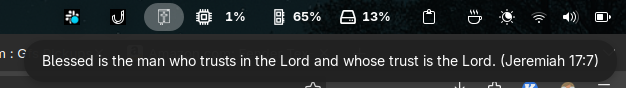

# Bible Verses Extension

Bible Verses is a GNOME Shell extension that displays a random Bible verse in a dropdown menu on your GNOME panel. It loads a list of verses from a text file and updates periodically so that you see a new inspirational verse every five minutes.

## Features

- **Random Bible Verses:** Displays a random verse from a curated list.
- **Automatic Updates:** Refreshes the verse every five minutes.
- **Theme-Aware Icon:** Automatically switches between a light and dark icon depending on your current GTK theme.
- **Customizable Style:** Uses a custom CSS stylesheet to style the displayed verses.

## Screenshot



## Installation

1. Clone or download this repository.
2. Copy the extension directory to your GNOME Shell extensions folder:
   ```
   cp -r bible-verses@ericrswanny.github.io ~/.local/share/gnome-shell/extensions/
   ```
3. Restart GNOME Shell (press <kbd>Alt</kbd>+<kbd>F2</kbd>, type `r` and press <kbd>Enter</kbd> or log out and back in).
4. Enable the extension using GNOME Tweaks or the Extensions app.

## Usage

Once installed and enabled, the Bible Verses extension will add an icon to your GNOME panel. Click the icon to view the current verse. The verse updates automatically every five minutes, but you can also restart GNOME Shell to load a new verse immediately.

## File Structure

- **extension.js:** Main extension script that handles loading verses, updating the icon based on theme, and refreshing the verse.
- **verses.txt:** Contains the list of Bible verses and references.
- **stylesheet.css:** Styles for the displayed verses.
- **media/screenshot.png:** A screenshot image demonstrating the extension in action.

## Contributing

Feel free to fork this repository and submit pull requests. Bug reports and feature suggestions are welcome.

## License

Distributed under the terms of your chosen license. See the LICENSE file for details.